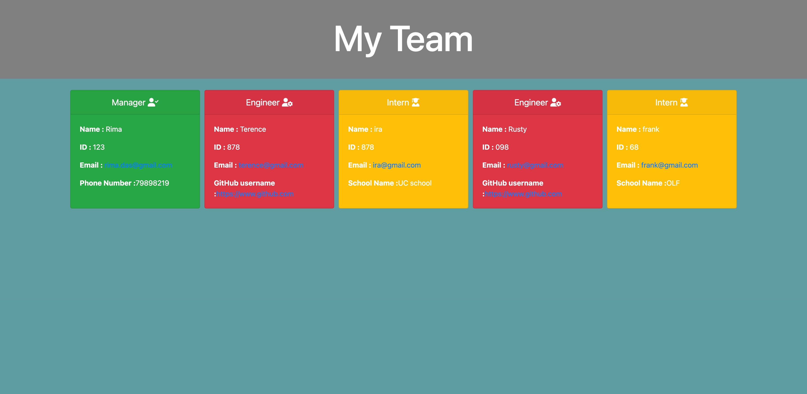

# Assignment 10 - Employee Details Form

## Description

This Assignment was about building a Node.js command-line application that takes in information about employees on a software engineering team, then generates an HTML webpage that displays summaries for each person and to add test files.

## How to generate the HTML file
1. Open Terminal and enter node index
2. You will be displayed set of questions, starting with Manager
3. Enter name, id, email and office phone number 
4. Then you will be given option to select Engineer or Intern
5. If u select Engineer, you will need to answer the questions related to Engineer i.e. name, id, email and gitHub URL
6. Then again you will be given option to select Engineer or Intern
7. Now if you select Intern, you will need to answer the questions related to Intern i.e. name, id, email and School
8. Then you have option to either quit or continue creating Engineers and Interns
9. Once you exit and HTML file will be generated in the dist folder with the name index.html
10. Open the file in the browser and you will see Manager in green, Engineer in Red and Interns in yellow
11. When you click on the email address, it will open an email box with the email added
12. Also when you click on the github URL, Git will open. 

Note

## How to generate the test result
1. Open Terminal and type npm run test
2. You will see result of all 4 files in the terminal

## Screen recording links
 1. Walkthrough video that displays list of questions and HTML file generation
      https://drive.google.com/file/d/1X0hbDQh7zIFb9fJe5Hp-wRnJuQVc8w12/view?usp=sharing

 2. Walkthrough video that displays clicking on the Email and GitHub links
    -https://drive.google.com/file/d/1Q_5JD5GFRjls2JXiYL0L0zNpMoRblvpA/view?usp=sharing

 3. Walkthrough video that displays the test result
    -https://drive.google.com/file/d/1YsdgzdUI1ThLMEuv3hlUvGrDVbYUU2DC/view?usp=sharing)

## Image of the HTML file
